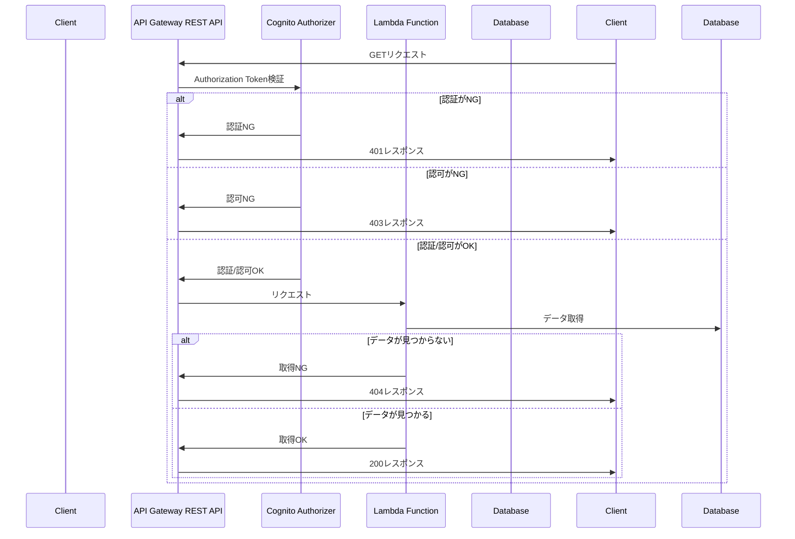

```mermaid
sequenceDiagram
    participant クライアント as Client
    participant API Gateway REST API
    participant Cognito Authorizer
    participant Lambda Function
    participant データベース as Database

    Client->>API Gateway REST API: GETリクエスト
    API Gateway REST API->>Cognito Authorizer: Authorization Token検証
    alt 認証がNG
        Cognito Authorizer->>API Gateway REST API: 認証NG
        API Gateway REST API->>Client: 401レスポンス
    else 認可がNG
        Cognito Authorizer->>API Gateway REST API: 認可NG
        API Gateway REST API->>Client: 403レスポンス
    else 認証/認可がOK
        Cognito Authorizer->>API Gateway REST API: 認証/認可OK
        API Gateway REST API->>Lambda Function: リクエスト
        Lambda Function->>Database: データ取得
        alt データが見つからない
            Lambda Function->>API Gateway REST API: 取得NG
            API Gateway REST API->>Client: 404レスポンス
        else データが見つかる
            Lambda Function->>API Gateway REST API: 取得OK
            API Gateway REST API->>Client: 200レスポンス
        end
    end
```
