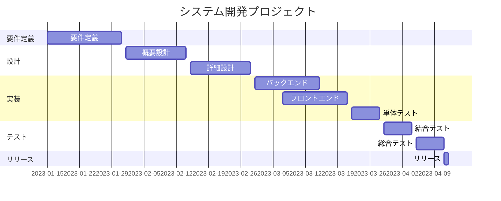

```mermaid
gantt
    dateFormat  YYYY-MM-DD
    title システム開発プロジェクト

    section 要件定義
    要件定義        : 2023-01-15, 2023-01-31

    section 設計
    概要設計          : 2023-02-01, 2023-02-14
    詳細設計          : 2023-02-15, 2023-02-28

    section 実装
    バックエンド      : 2023-03-01, 2023-03-15
    フロントエンド    : 2023-03-07, 2023-03-21
    単体テスト        : 2023-03-22, 2023-03-28

    section テスト
    結合テスト        : 2023-03-29, 2023-04-04
    総合テスト        : 2023-04-05, 2023-04-11

    section リリース
    リリース          : 2023-04-12
```
