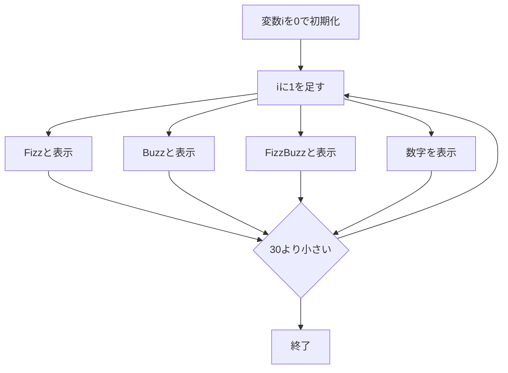

```mermaid
graph TD
  A[変数iを0で初期化] --> B[iに1を足す]
  B --> C{3の倍数}
  B --> D{5の倍数}
  B --> E{15の倍数}
  B --> F[それ以外]
  C["Fizzと表示"] --> G[判定]
  D["Buzzと表示"] --> G
  E["FizzBuzzと表示"] --> G
  F["数字を表示"] --> G
  G{30より小さい} --> B
  G --> H[終了]
```
