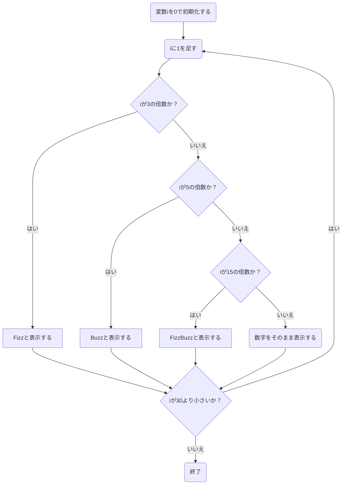

```mermaid
graph TD
    A(変数iを0で初期化する) --> B(iに1を足す)
    B --> C{iが3の倍数か？}
    C -->|はい| D[Fizzと表示する]
    C -->|いいえ| E{iが5の倍数か？}
    E -->|はい| F[Buzzと表示する]
    E -->|いいえ| G{iが15の倍数か？}
    G -->|はい| H[FizzBuzzと表示する]
    G -->|いいえ| I(数字をそのまま表示する)
    D --> J{iが30より小さいか？}
    F --> J
    H --> J
    I --> J
    J -->|はい| B
    J -->|いいえ| K(終了)
```
