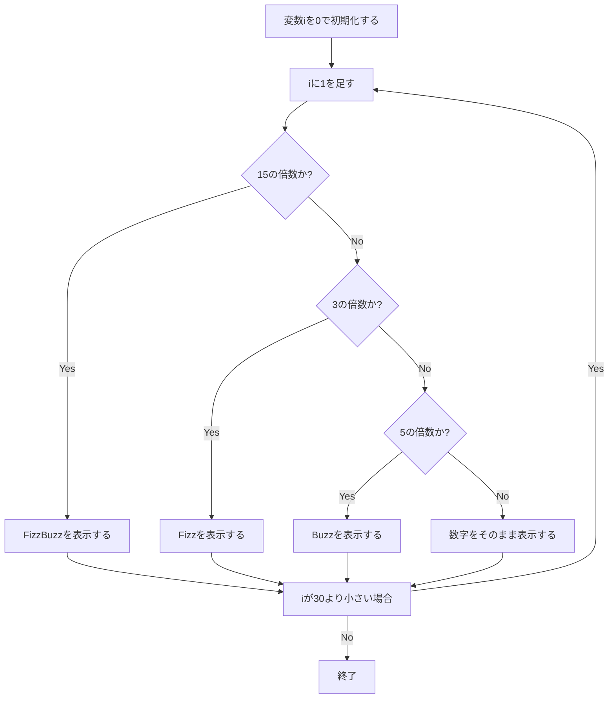

```mermaid
graph TD
  A[変数iを0で初期化する]
  B[iに1を足す]
  C{3の倍数か?}
  D{5の倍数か?}
  E{15の倍数か?}
  F[Fizzを表示する]
  G[Buzzを表示する]
  H[FizzBuzzを表示する]
  I[数字をそのまま表示する]
  J[iが30より小さい場合]

  A --> B
  B --> E
  E -->|Yes| H
  E -->|No| C
  C -->|Yes| F
  C -->|No| D
  D -->|Yes| G
  D -->|No| I
  F --> J
  G --> J
  H --> J
  I --> J
  J -->|Yes| B
  J -->|No| Z[終了]
```
