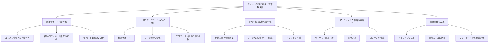
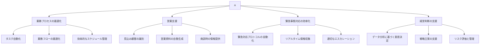
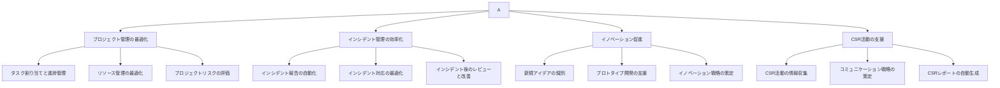

## USER
chatGPTを利用した業務改善について、社内提案できる形でマインドマップにまとめて、Mermaid構文で書いて下さい。

## ASSISTANT

## USER
Please continue

## ASSISTANT

このマインドマップは、ChatGPTを利用した業務改善に関する提案をさらに広げたものです。各項目について詳細な情報やアイデアを追加することで、社内での提案がより具体的になります。このマインドマップを活用して、ChatGPTの活用範囲を拡大し、業務効率化や働き方改革に役立てることができます。

## USER
Please continue

## ASSISTANT

このマインドマップは、ChatGPTを利用した業務改善に関する提案をさらに広げたものです。各項目について詳細な情報やアイデアを追加することで、社内での提案がより具体的になります。このマインドマップを活用して、ChatGPTの活用範囲を拡大し、業務効率化や働き方改革に役立てることができます。
